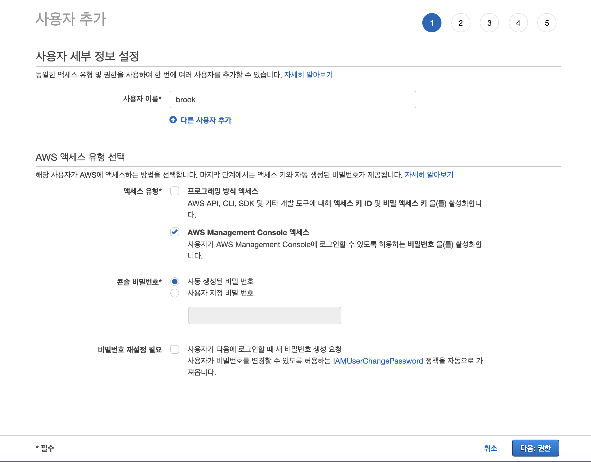
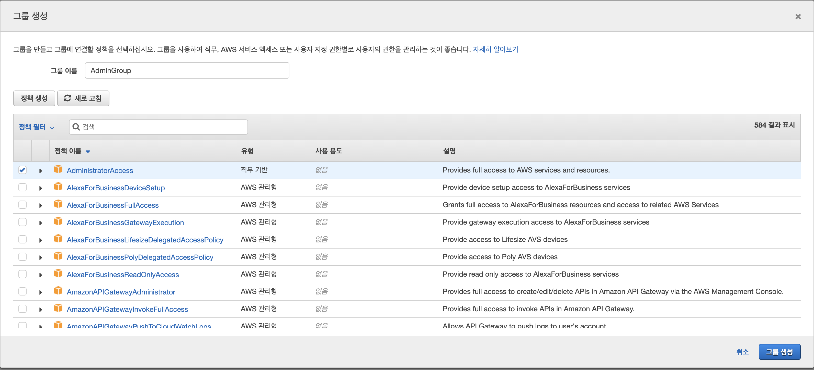
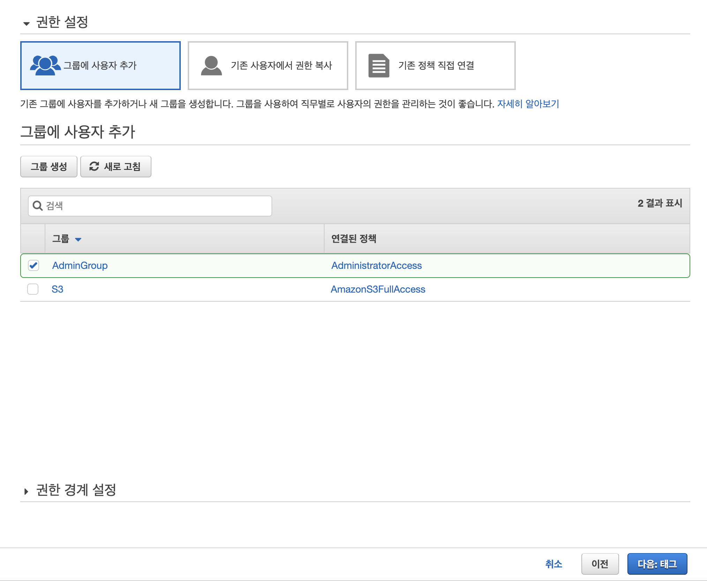
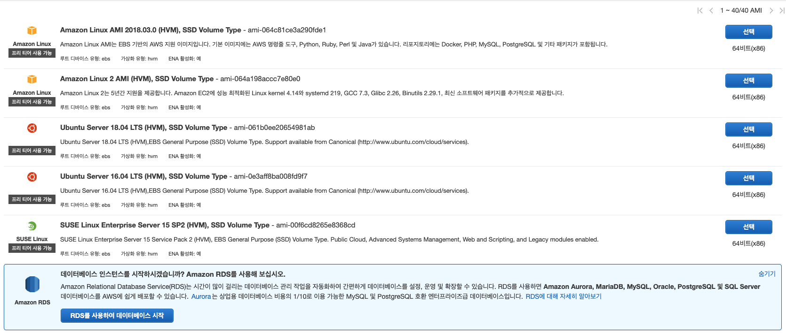
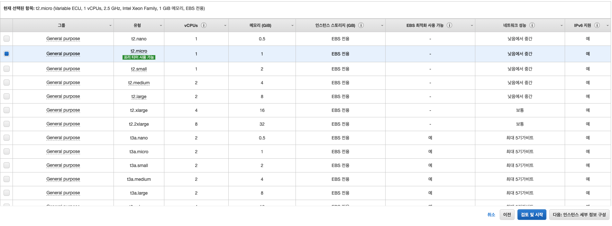
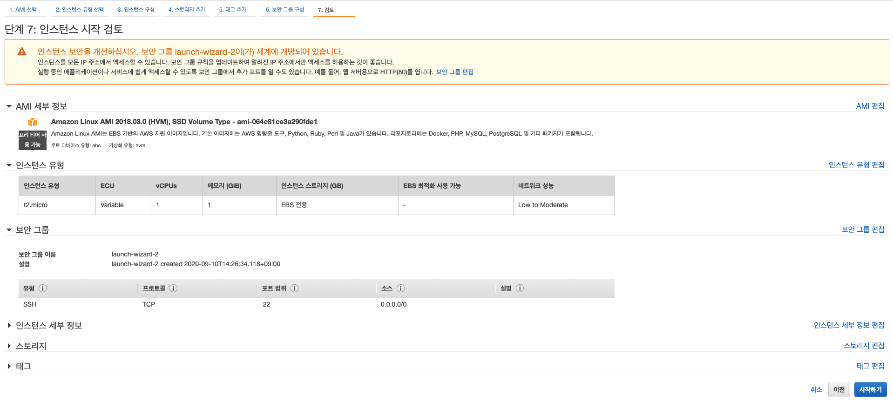
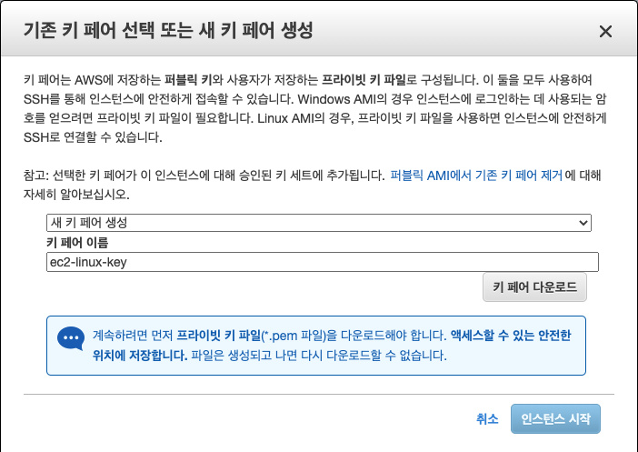
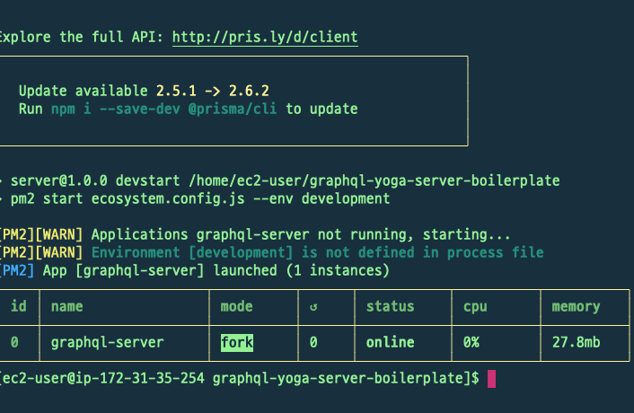
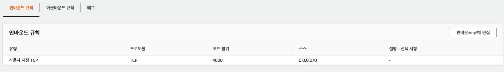
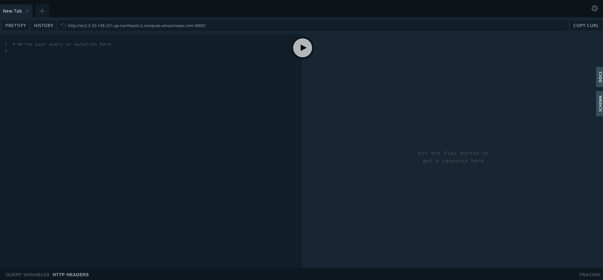

# **🌴 AWS**

<br>
<br>
<br>


# 🏷 IAM 설정

- IAM(AWS Identity and Access Management)은 AWS 리소스에 대한 액세스를 안전하게 제어할 수 있는 웹 서비스입니다. IAM을 사용하여 리소스를 사용하도록 인증 및 권한 부여된 대상을 제어합니다.

<br>

1. 내 보안 자격 증명으로 들어간다.

<br>

2. 액세스 관리 > 사용자로 들어간다.

<br>

3. 사용자 추가를 클릭한다.

<br>

4. 사용자 이름을 기재하고, 액세스 유형을 `AWS Management Console 액세스` 로 선택하고 콘솔 비밀번호는 `자동 생성된 비밀번호`로 선택하며 비밀번호 재설정 필요는 선택해제를 한뒤 다음을 클릭한다.



<br>

5. 그룹 생성을 클릭한다.

<br>

6. 그룹 이름을 기재하고 `AdministratorAccess` 를 선택한뒤 그룹 생성을 클릭한다.



<br>

7. 생성된 관리자 그룹에 사용자를 추가하려면 `다음:태그` 를 클릭한다.



<br>

8. 태그 추가는 무시하고 `다음:검토` 를 클릭한다.

<br>

9. 사용자 세부정보와 그룹이름을 확인한뒤 `사용자 만들기` 를 클릭한다.

<br>

10. 이후 나오는 CSV 파일을 안전한곳에 저장한다.
 

이 계정의 파일은 다시 생성이 불가능하므로 꼭 다운로드 받아야한다.

<br>
<br>
<br>

# 🏷 EC2 설정

1. EC2 대시보드로 이동해서 인스턴스 시작을 클릭한다.

<br>

2. `Amazon Linux AMI 2018.03.0 (HVM), SSD Volume Type - ami-064c81ce3a290fde1` 를 선택한다.



<br>

3. 기본 선택되어 있는 `t2.micro` 를 선택한 뒤 검토 및 시작 버튼을 클릭한다.



<br>

4. 설정한 인스턴스 값들을 확인후 시작하기 버튼을 클릭한다.



<br>

5. 키 페어 선택

기존 키 페어가 있을경우 기존 키 페어를 사용하고 없을 경우 새 키 페어 생성을 선택하고 키 페어 이름을 기재하고 키 페어 다운로드 버튼 클릭으로 키 페어를 받는다. 키 페어는 서버에 접속하는 열쇠이므로 분실하거나 유출되면 안된다.

다운로드를 한 뒤 인스턴스 시작 버튼을 클릭한다.



<br>

6. 인스턴스가 생성되려면 몇분의 시간이 소요되므로 인스턴스 상태가 `running` 이 될때까지 기다린다.

<br>
<br>
<br>

# 🏷 SSH 접속

```bash
chmod 400 ./{PEM_KEY_NAME}.pem

ssh -i ./{PEM_KEY_NAME}.pem ec2-user@{PUBLIC_DNS}
```

- ssh 가 작동하려면 pem 키가 공개적으로 보여지면 안된다. chmod 400 으로 읽기 전용으로 권한부여를 한다.

- 참고 블로그

    [EC2로 node.js (express)배포하기(pm2, nginx 사용)](https://parkjihwan.tistory.com/7)

<br>
<br>
<br>

# 🏷 필요 프로그램 설치

1. nvm 설치

```bash
curl -o- https://raw.githubusercontent.com/nvm-sh/nvm/v0.35.3/install.sh | bash
```

- 공식 문서 참고

    [nvm-sh/nvm](https://github.com/nvm-sh/nvm)

<br>

2. nvm 활성화

```bash
. ~/.nvm/nvm.sh
```

<br>

3. node 설치

설치후 버전확인을 통해 설치가 잘되었는지 확인한다.

```bash
nvm install node 또는 nvm install 12.13.1[특정 버전]

node --version
```

<br>

4. git 설치

```bash
sudo yum install git
```

<br>

5. git에 저장되어있는 저장소 가져오기

```bash
git clone [저장소 주소]
```

<br>

6. docker 설치

설치 후 잘 설치 되었는지 버전체크를 한다.

```bash
sudo yum install docker -y

docker -v
```

<br>

7. docker 시작하기

```bash
sudo service docker start
```

<br>

8. sudo를 사용하지 않고 docker 명령어 사용

아래 커맨드를 실행하고도 docker 명령어가 sudo 없이 작동되지 않을 경우 ec2 서버에서 나갔다 다시 들어온다.

```bash
sudo usermod -a -G docker ec2-user
```

<br>

9. docker-compose 설치

```bash
sudo curl -L "https://github.com/docker/compose/releases/download/1.27.0/docker-compose-$(uname -s)-$(uname -m)" -o /usr/local/bin/docker-compose
```

- 공식 문서 참고

    [Install Docker Compose](https://docs.docker.com/compose/install/)

<br>

10. docker-compose 실행권한 추가 및 설치 확인

```bash
sudo chmod +x /usr/local/bin/docker-compose

docker-compose -v
```

<br>
<br>
<br>

# 🏷 docker container 실행

1. git에서 clone한 프로젝트 루트에서 `docker-compose up -d` 커맨드를 실행한다.

<br>

2. `docker ps` 커맨드 실행하여 컨테이너가 잘 실행되는지 확인한다.

<br>
<br>
<br>

# 🏷 서버 실행

1. pm2 설치

pm2 를 전역으로 설치해준다.

```bash
npm install pm2 -g
```

<br>

2. git에서 clone한 프로젝트 루트로 이동한뒤 `npm install` 커맨드를 실행한다.

<br>

3. npm run sync 커맨드를 실행한다.

<br>

4. npm run devstart 커맨드를 실행해준다.



<br>

5. 인바운드 규칙

ec2 서버 내에 시작한 서버의 포트를 인바운드 규칙에 추가한다.



<br>

6. {퍼블릭 DNS}:4000 으로 접속한다.



